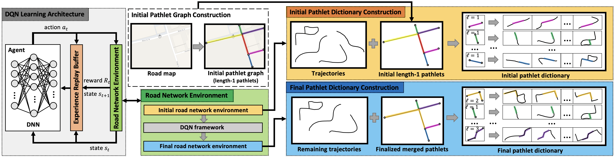
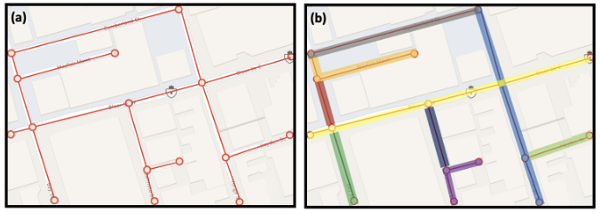

# PathletRL++: Enhanced Trajectory Pathlet Dictionary Construction using Reinforcement Learning

PathletRL++ is an advanced deep reinforcement learning model for constructing trajectory pathlet dictionaries, enhancing upon the original [PathletRL](https://doi.org/10.1145/3589132.3625622) ([Github Repo](https://github.com/techGIAN/PathletRL/)). This repository provides the latest version, **PathletRL++**, which achieves superior dictionary compression and training efficiency for large-scale trajectory datasets.

The original PathletRL paper, presented at the 2023 ACM SIGSPATIAL conference (nominated for Best Paper Award!), is accessible via [DOI](https://doi.org/10.1145/3589132.3625622) or [Google Drive](https://drive.google.com/drive/folders/1C20g9dzVb_lhyIas2U96nAuqXOZUmZtJ?usp=sharing).



## Abstract
Advances in tracking technologies have spurred the rapid growth of large-scale trajectory data. Building a
compact collection of pathlets, referred to as a trajectory pathlet dictionary, is essential for supporting mobility-
related applications. Existing methods typically adopt a top-down approach, generating numerous candidate
pathlets and selecting a subset, leading to high memory usage and redundant storage from overlapping pathlets.
To overcome these limitations, we propose a bottom-up strategy that incrementally merges basic pathlets to
build the dictionary, reducing memory requirements by up to 24,000 times compared to baseline methods.
The approach begins with unit-length pathlets and iteratively merges them while optimizing utility, which is
defined using newly introduced metrics of trajectory loss and representability. We develop a deep reinforcement
learning framework, PathletRL, which utilizes Deep Q-Networks (DQN) to approximate the utility function,
resulting in a compact and efficient pathlet dictionary. Experiments on both synthetic and real-world datasets
demonstrate that our method outperforms state-of-the-art techniques, reducing the size of the constructed
dictionary by up to 65.8%. Additionally, our results show that only half of the dictionary pathlets are needed
to reconstruct 85% of the original trajectory data. Building on PathletRL, we introduce PathletRL++, which
extends the original model by incorporating a richer state representation and an improved reward function
to optimize decision-making during pathlet merging. These enhancements enable the agent to gain a more
nuanced understanding of the environment, leading to higher-quality pathlet dictionaries. PathletRL++
achieves even greater dictionary size reduction, surpassing the performance of PathletRL, while maintaining
high trajectory representability

## Pathlets

<p align="center">
  
</p>

**Pathlets** are basically subpaths of the road network. In our setup, we frame pathlets as *edge-disjoint*, which means that no two pathlets are overlapping (in terms of edges). In the example above, (a) represents the graph-based representation of a road network in a small area in Toronto, and (b) are some examples of edge-disjoint pathlets of various lengths.

## Requirements
The code was run in a Windows environment, but it can also be run on Mac systems (based on the packages listed in `requirements.txt`). In general, you can install all required packages using the following command:

```
pip install -r requirements.txt
```

The primary RL library used is `Stable-Baselines3` for implementing the DQN agent.

## Datasets
In our experiments, we used the ```Toronto``` dataset, which we provide the link on our [shared Google Drive](https://drive.google.com/drive/folders/1e-9M7oaRs1rjczetsu5Hw-zJ4ye1km1l?usp=sharing) (we could not share it through Github due to size). Moreover, the ```Rome``` dataset that we also used is publicly available and is being hosted on [Crawdad](https://crawdad.org/). In case you want to use your own datasets, here are the specifics for curating and formatting them appropriately. Please ensure first that your datasets have already been [map-matched](https://dl.acm.org/doi/10.1145/1653771.1653820)). Now grab your dataset and preprocess it as follows:

1. Have a ```.json``` file called ```traj_edge_dict.json```. This dictionary should have the following keys and values formatting:

| Keys | Values |
| --- | --- |
| ```1``` | ```[[273, 272], [272, 347], [347, 321], [321, 379], [379, 385], [385, 320]]``` |
| ```6``` | ```[[1362, 1558]]``` |
| ```11``` | ```[[115, 349], [349, 348], [348, 605]]``` |
| ... | ... |

Here, each trajectory (keys are the trajectory IDs) is mapped to a list of edges (road segments) in the road network (i.e., ```[u, v]``` is an edge in the road network where ```u``` and ```v``` are node/road intersection IDs). It is important to note that all trajectories have to be continuous (no gaps), which means that the "end node" of the previous edge is the same as the "start node" of the following edge. Ensure this, otherwise you could run into errors later in the long run.

2. Now curate ```pathlet_dict.json```, which you can also do before Step 3. Each key here represents the IDs of the pathlets or edges (the road segments), and then the values are consists of a list of the IDs of the nodes/road intersections. Here is an example:

| Keys | Values |
| --- | --- |
| ```'321'``` | ```[0, 1]``` |
| ```'48612'``` | ```[1364, 0]``` |
| ```'49547'``` | ```[687, 1]``` |
| ... | ... |

## Running PathletRL++

1. Place all prepared datasets under the `data/` directory.
2. PathletRL++ accepts command-line arguments for key parameters, allowing dynamic tuning of thresholds and hyperparameters. Below is an example command to train the PathletRL++ agent:

```bash
python pathlet_rl_plus_plus.py --seed 0 --M 0.25 --mu_threshold 0.8 --k 10 --lr 0.001 --buffer_size 100000 --learning_starts 1000 --exploration_initial_eps 1.0 --exploration_final_eps 0.001 --exploration_fraction 0.6 --batch_size 64 --gamma 0.99 --timesteps 100000

```
### Command-Line Arguments
- **`--seed`**: Random seed for reproducibility.
- **`--M`**: Trajectory loss threshold.
- **`--mu_threshold`**: Coverage threshold.
- **`--k`**: Maximum pathlet length.
- **`--lr`**: Learning rate.
- **`--buffer_size`**: Replay buffer size.
- **`--learning_starts`**: Number of steps before training starts.
- **`--exploration_initial_eps`**: Initial epsilon for exploration.
- **`--exploration_final_eps`**: Final epsilon for exploration.
- **`--exploration_fraction`**: Fraction of steps for epsilon decay.
- **`--batch_size`**: Batch size for training.
- **`--gamma`**: Discount factor.
- **`--timesteps`**: Total number of training timesteps.

## Contact

Please contact me arianhgh@my.yorku.ca for any bugs/issues/questions you may have found on our code. Thank you so much.
